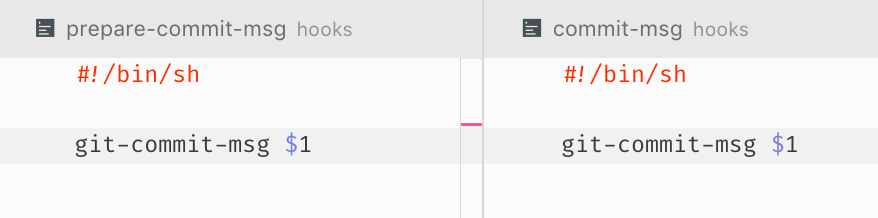

# git-commit-msg

Adds emojis and infers commit context for people who use conventional commits

1. install it as git hooks: `prepare-commit-msg` and `commit-msg`
2. follow git conventional commits: https://www.conventionalcommits.org/en/v1.0.0-beta.2/
3. ???
4. PROFIT

## demo

Open GIF spoiler

demo on streamable: https://streamable.com/n0u5p
webm: https://github.com/ColCh/git-commit-msg/blob/master/demo/demo.webm

## more info

This hook currently does that:

1. Prepend emoji before git commit type. Predefined types are here: https://github.com/ColCh/git-commit-msg/blob/24ee7befa462b624705908b8b698db3c1704bd04/index.js#L13-L24
2. Mark words with predefined emoji defined here: https://github.com/ColCh/git-commit-msg/blob/24ee7befa462b624705908b8b698db3c1704bd04/index.js#L26-L43. Example: https://github.com/ColCh/git-commit-msg/blob/24ee7befa462b624705908b8b698db3c1704bd04/__tests__/__snapshots__/index.js.snap#L49-L79
3. Try to infer git commit context. Example: https://github.com/ColCh/git-commit-msg/blob/24ee7befa462b624705908b8b698db3c1704bd04/__tests__/__snapshots__/e2e.js.snap#L5-L8

### install

`yarn global add @colch/git-commit-msg`

add `git-commit-msg` into `prepare-commit-msg` and `commit-msg` hooks:

`git-commit-msg $1`

to appear like that:

### options

pass it like env variables

* `SKIP_ADDING_EMOJIS` - completely disable emojis

* `SKIP_AUTO_SUGGEST` - disable emoji auto suggest